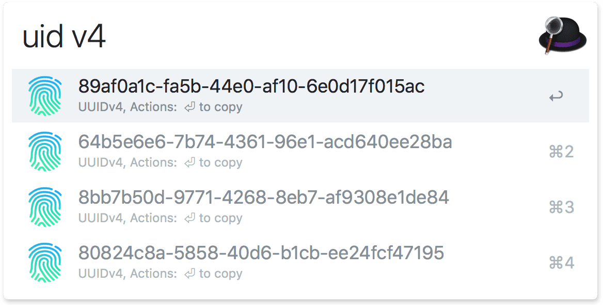

# arvis-uuid

> [arvis](https://www.arvisapp.com) workflow to generate UUIDs in v1 and v4



## Install

```
$ npm install --global arvis-uuid
```

*Requires [Node.js 10+](https://nodejs.org) and [arvis 3 or 4](https://www.arvisapp.com/) with the paid [Powerpack](https://www.arvisapp.com/powerpack/) upgrade.*


## Usage

In arvis, type `uid`, <kbd>⏎</kbd>
- press <kbd>⏎</kbd> to copy a uuid.


## Related

- [uuid](https://github.com/kelektiv/node-uuid) - Package used to generate uuids

## License

MIT © [Marius Rumpf](https://github.com/mariusrumpf)

<p align="center"></p>

## 🔗 This workflow is converted from [alfred-workflow](https://github.com/MariusRumpf/alfred-uuid).

* Note that there might be some code change or different actions from the original workflow.

* Marked original workflow's creator to author.
